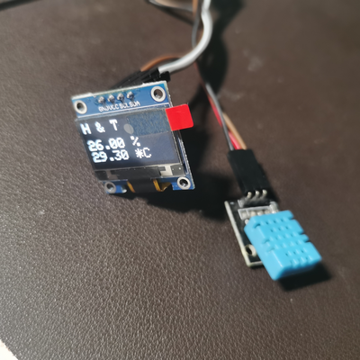

# ESP8266 DHT11

## Hardware




## Hardware Installation

### ESP-12E

#### ESP-12E <> DHT11

| ESP-12E | DHT11 |
| ------- | ----- |
| GND     | -     |
| 3V3     | +     |
| D4      | S     |

Note that `main.h` should be as below (`D4` is `GPIO2`):

```cpp
#define DHTPIN 2
```

#### ESP-12E <> OLED (4PIN)

| ESP-12E | OLED (4PIN) |
| ------- | ----------- |
| GND     | GND         |
| 3V3     | VCC         |
| D1      | SCL         |
| D2      | SDA         |
